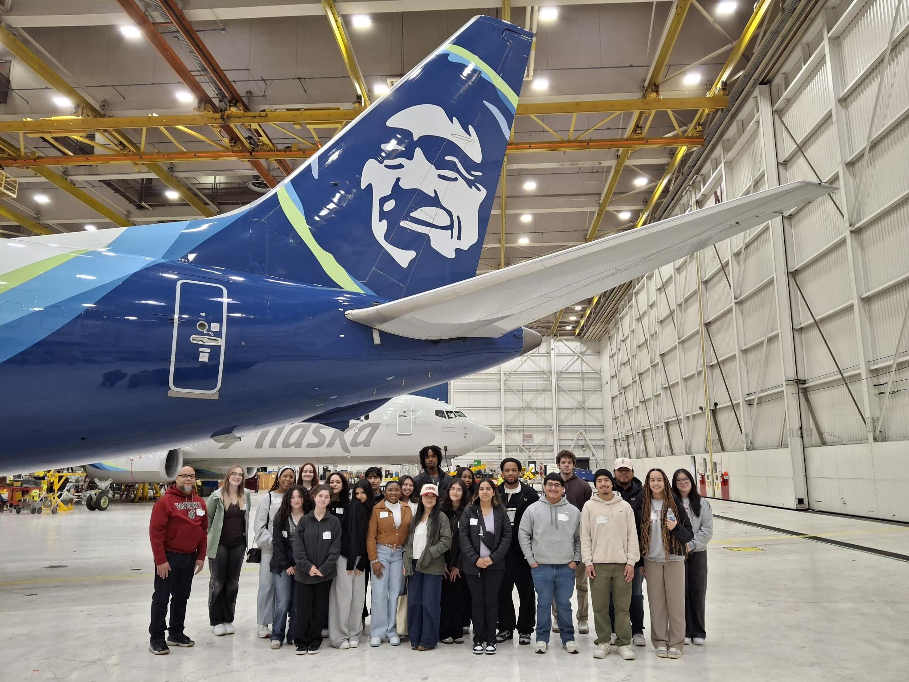
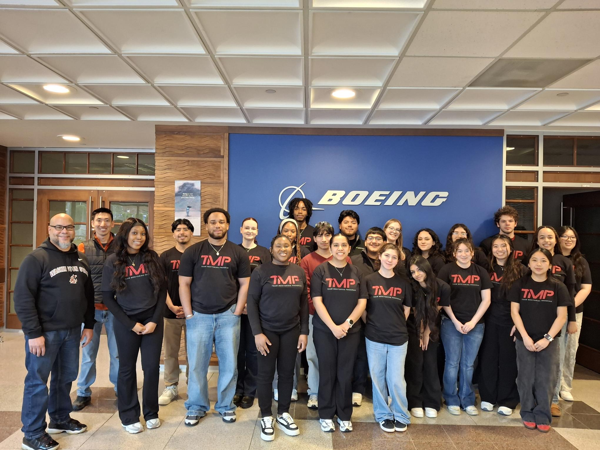
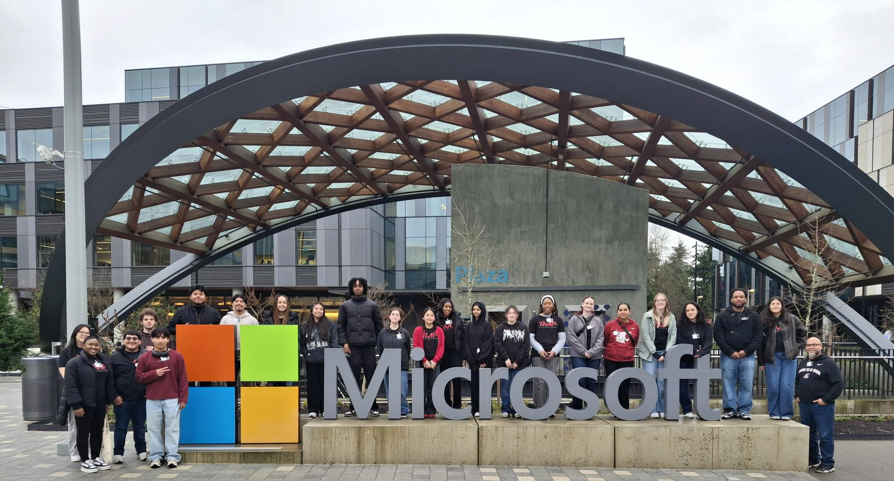

## Activity Description
During spring break, I participated in a career field trip for a program called the Team Mentoring Program. We visted locations such as Boeing, Alaska Airlines, and Microsoft to learn about all the different opportunities available to students.  

## Professional Decisions & Contributions
During this three‑day trip, I made an effort to focus on networking. While we visisted each location, I took the time to speak with the professionals who guided us through the tours. Many of them offered valuable insights, and one piece of advice in particular stayed with me, “You are two things throughout your life, the people you surround yourself with and the things you read.” That perspective helped me see the importance of being intentional about the relationships I build and the knowledge I choose to pursue as I continue developing professionally.

## Quality Assessment
If I had the opportunity to repeat this trip, I would be much more intentional with the questions I asked. I realized that I wasn’t fully clear on what I hoped to gain from each conversation, which limited the insights I received. Taking time beforehand to reflect on my goals for the trip would have helped me ask more purposeful questions and get even more value out of the discussions I had.

## Career Alignment
This experience helped me understand how to better position myself for the career I want to pursue. It made me more aware of how intentional I need to be with the language and structure of my resume. Another major takeaway was the importance of using LinkedIn consistently. I hadn’t realized how powerful it can be for building connections, and during the trip I was able to form several that I believe will be valuable moving forward. These connections can provide me wiht professional guidance, mentorship, and even recommendations for future roles. Overall, everything I learned on this trip will help me enter the job market more prepareed for a career in Cybersecurity.

## Proof
### Alaska Airlines Picture: 

---
### Boeing Picture: 

---
### Microsoft Picture: 

