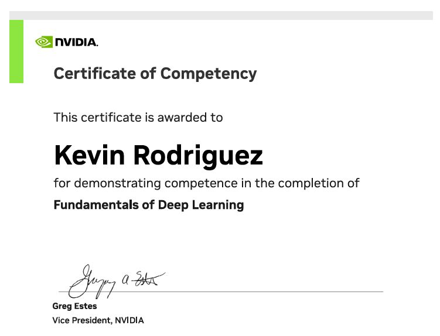

# Activity: NVIDIA Deep Learning Hands-on Training
- Note: There is an image in the "EA2" folder that serves as proof of completion. However, there is no project that I took home from this event, so I do not have a Github repo to show the hands portion. The reason for this is because all the work was done on NVIDIAs learning platform, which closed access after completing the workshop. 

## Certification Image 
- 

## Activity Description
- I participated in a NVIDIA Deep Learning Workshop. During this workshop, I was expected to learn about the basics of training a neural network, the different kinds of AI training, and a small section regarding AI vision. Towards the end of this event, I also took a test based on what I had learned from workshop and I recieved a NVIDIA certification.

## Technical Decisions
- During this event, I was forced to think about many constraints. For example, I had a team with two other classmates and one of the challenges was to work on the project simultaneously without causing a whole lot of collisions. I created a rule that we could not be working on the same coding file or else the risks of collisions would drastically rise. We did not want to deal with these issues because time was something I kept in mind. One more example of a technical decision was the software architecture of our project. As a group, we were able to discuss what frameworks and languages we were the most comfortable with. This allowed me to choose a nice framework that would suit our project. For instance, I was able to choose JavaScript and Python, along with React and Flask.

## Contributions
- During this event, I participated alone.

## Quality Assessment
- If I was able to redo the event, I would have 
